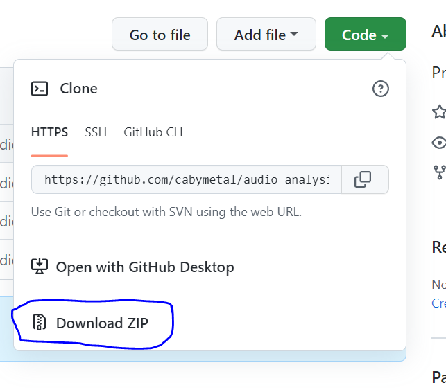
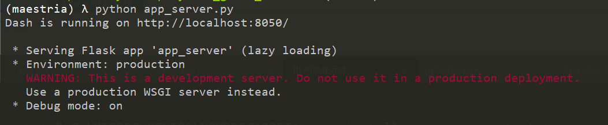
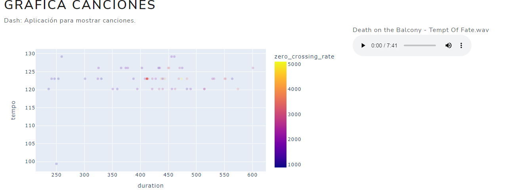

# Clasificación Musical
## Proyecto de Grado Maestría

### Descripción
Por realizar

### Configuración tablero de control

Clonar o descargar una copia del repositorio

para clonar el repositorio
<p style="background:black">
<code style="background:black;color:white">C:\MISDOCUMENTOS> git clone this_repo NOMBRECARPETA
</code>
</p>

descargarlo presionar en el botón descargar <br>


copiar canciones a analizar en la carpeta assets/Audio/ estoy trabajando con la muestra de canciones del repositorio compartido

Crear un ambiente de ejecución utilizando `virtualenv`
<p style="background:black">
<code style="background:black;color:white">C:\MISDOCUMENTOS\NOMBRECARPETA>virtualenv -m python NOMBREAMBIENTE
</code>
</p>

una vez se crean las carpetas se procede a activar el ambiente

<p style="background:black">
<code style="background:black;color:white">C:\MISDOCUMENTOS\NOMBRECARPETA>maestria/Scripts/activate.bat
</code>
</p>

Instalar las librerías necesarias

<p style="background:black">
<code style="background:black;color:white">C:\MISDOCUMENTOS\NOMBRECARPETA> pip install -r requirements.txt
</code>
</p>

Ejecutar el proyecto

<p style="background:black">
<code style="background:black;color:white">C:\MISDOCUMENTOS\NOMBRECARPETA> python app_server.py
</code>
</p>

si todo va bien se muestra la siguiente imagen <br>


abrir un explorador en localhost:8050 y veremos la siguiente página web con el tablero de control<br>


## Proceso de despliegue aws
primero se realiza una pequeña limpieza del bucket con el siguiente script
```Python
import boto3
s3 = boto3.resource('s3')
bucket_name = 'mybucketnamehere'
bucket = s3.Bucket(bucket_name)

for obj in bucket.objects.all():
    if '..' in obj or 'png' in obj:
        print(obj.key)
        s3.Object(obj.bucket_name, obj.key).delete()
```
luego sincronizo la carpeta actual para subir sus contenidos a s3 corro el siguiente comando en consola
```
 aws s3 sync . s3://bucket_name/FlaskApp
```

para llevar los archivos a EC2 se ingresa a la consola de aws y se abre la instancia
conectarse a la instancia
```
~Desktop/Document> ssh -i "pc_key_pair.pem" ubuntu@ec2-ip-aws-aqui.compute-1.amazonaws.com
```
en la instancia hay una carpeta flask_app y reemplazar los archivos que se encuentren en
esta con los archivos que se publicaron en el bucket de s3
```
 aws s3 sync s3://bucket_name/FlaskApp .
```

En la instancia existen dos procesos ya configurados previamente uno es un servidor `Nginx` y el otro es un servidor `gunicorn`,
se puede ver un paso a paso de instalación en este link 

para verificar que se encuentren activos podemos ejecutar
```systemctl status nginx```
y 
```systemctl status flask_app```
respectivamente, si ambos se encuentran activos se puede acceder al tablero en internet en la dirección ip pública


### Análisis exploratorio de datos

Revisar los jupyter notebook del repositorio. en el cual se establece la metodología de selección de características
para variables clásicas como un aproximación utilizando un modelo Preentrenado, usando redes neuronales.

